# APIJSON

[TOC]


## A.介绍

### A1.关于接口开发

首先是看名字`APIJSON`，API是说这个项目是属于接口开发的项目，JSON是指传输数据格式是JSON格式。介于各位看官的水平高低不齐，这里就先为没有项目经验朋友啰嗦两句接口开发的内容。有经验的朋友可以跳到`A2`继续查看。

（此处内容以后会有的）

### A2.功能说明

一个接口的开发，比如Java用SpringBoot，Mybatis来开发一般来说就像下面这个流程

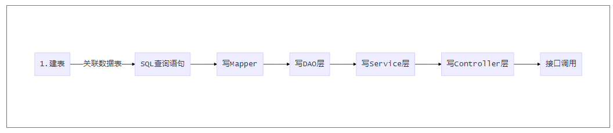

部署上这个项目后，流程变成了这样

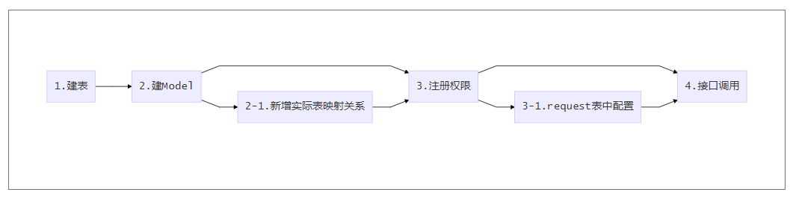

换句说，使用这个项目作为后端的支持的话，是不需要对每个表写增删改等接口的，只需在该项目连接的数据里进行表的创建，以及配置接口权限即可。无需进行过多的开发，哪怕是要改结构也仅仅只需要修改表字段而已。想想仅仅是部署一个后端项目，现在需要些的接口就基本写好了，直接调用就行了，是不是挺爽的。

说这么多，咱们直接开干吧！


## B.安装&使用
>JDK： 1.8+
>
>Maven： 4.0+
>
>数据库：Mysql，Oralce

### B1.下载项目

```bash
git clone https://github.com/TommyLemon/APIJSON.git
```

或者，直接下载ZIP打包好的项目文件。

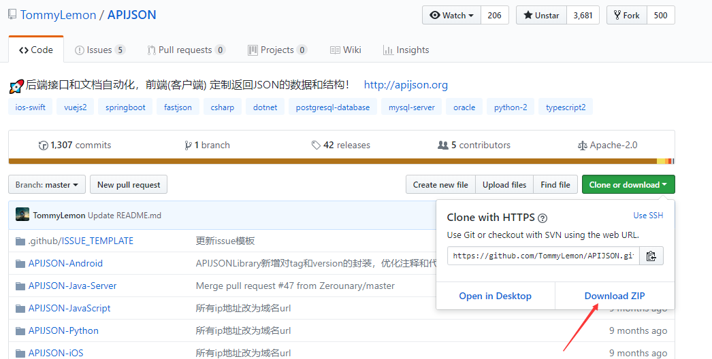


### B2.导入项目

Eclipse导入：

顶部菜单File > Import > Maven > Existing Maven Projects > Next > Browse

`APIJSON-Master/APIJSON-Java-Server/APIJSONDemo`

报依赖错误的时候，同目录下的`lib`里面的`jar`添加到`Build Path`中。

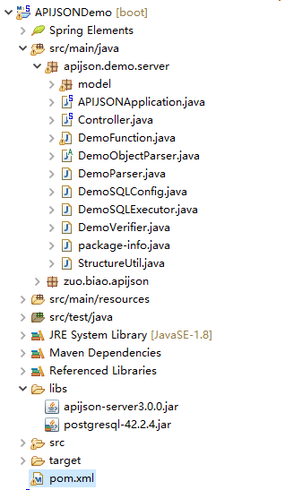

为了方便修改源代码，你可以像我一样不添加`libs/apijson-server3.0.0.jar`文件到`Build Path`中。而是`libs/apijson-server3.0.0.jar`的源码，复制到当前项目里。

源代码在`APIJSON-Master/APIJSON-Java-Server/APIJSONLibrary`项目中。

## C.开发说明

### C-1.基于Mysql数据库的开发流程

####  C-1-1.修改数据库链接

如我的数据库信息是这样的

| 数据库参数 | 值                  |
| ---------- | ------------------- |
| 地址       | 192.168.71.146:3306 |
| 用户       | root                |
| 密码       | root                |
| 数据库     | thea                |


那么需要在`DemoSQLConfig`，40-61行，改为自己数据库对应的链接

```java
	@Override
	public String getDBUri() {
		//TODO 改成你自己的
		return DATABASE_POSTGRESQL.equalsIgnoreCase(getDatabase()) ? "jdbc:postgresql://localhost:5432/postgres" : "jdbc:mysql://192.168.71.146:3306/";
	}
	@Override
	public String getDBAccount() {
		return DATABASE_POSTGRESQL.equalsIgnoreCase(getDatabase()) ? "postgres" : "root"; //TODO 改成你自己的
	}
	@Override
	public String getDBPassword() {
		return DATABASE_POSTGRESQL.equalsIgnoreCase(getDatabase()) ? null : "root"; //TODO 改成你自己的
	}
	@Override
	public String getSchema() {
		String s = super.getSchema();
		return StringUtil.isEmpty(s, true) ? "thea" : s; //TODO 改成你自己的
	}
```

#### C-1-2.导入表

在`APIJSON-Master/MySQL`目录下有一批SQL脚本，他们看起来是这样的

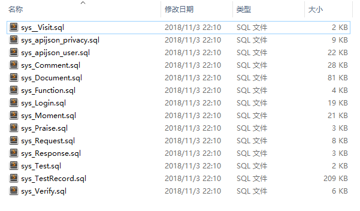

导入完成之后。我们可以把项目跑起来看下，以刚刚配置的项目，项目是否能够连上数据库。其中也有一些初始化数据，可以方便我们测试。

#### C-1-3.测试查询

为了方便测试，我这里使用的Chrome浏览器的Restlet Client插件，大家可以根据自己的喜好使用不同的工具测试。

使用` http://localhost:8080/get`测试结果。

随便找一个表，比如`Moment`表，我们取其中ID为12的一条出来看看

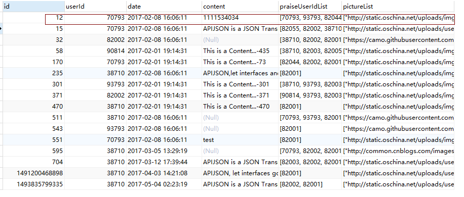

对接口地址`http://localhost:8080/get`发送一个JSON格式的请求

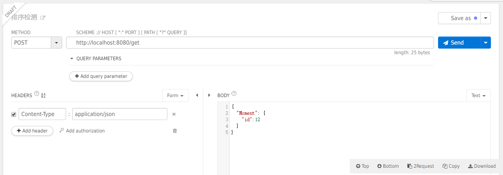

请求的JSON:

```json
{
  "Moment": {
    "id":12
  }
}
```

响应的JSON：

```json
{
    "Moment": {
        "content": "1111534034",
        "date": "2017-02-08 16:06:11.0",
        "id": 12,
        "pictureList": [
            "http://static.oschina.net/uploads/img/201604/22172508_eGDi.jpg",
            "http://static.oschina.net/uploads/img/201604/22172507_rrZ5.jpg"
        ],
        "praiseUserIdList": [
            70793,
            93793,
            82001
        ],
        "userId": 70793
    },
    "code": 200,
    "msg": "success"
}
```


##### 字段过滤

这里这么多字段，如果我只想要这个`content`字段的信息怎么办？

你可以这样请求：

```json
{
  "Moment": {
    "id":12,
    "@column":"content"
  }
}
```

响应：

```json
{
    "Moment": {
        "content": "1111534034"
    },
    "code": 200,
    "msg": "success"
}
```

`@column`表示你要筛选出的字段，如果是多个字段可以这样写`"@column":"id,date,content"`


##### 字段别名

如果想要使用字段的别名应该这样写：`"@column":"id,date:time,content:text"`

```json
{
    "Moment": {
        "text": "1111534034",
        "time": "2017-02-08 16:06:11.0",
        "id": 12
    }
}
```

这样在返回的数据中`date`字段就变成了`time`，`content`字段变成了`text`。


##### 逻辑运算

如果想要筛选出，ID在`12,15,32`中的这三条数据的`日期`和`内容`怎么办呢？

请求：

```json
{
  "[]": {
      "Moment":{
        "id{}":[12,15,32],
        "@column":"id,date,content"
      }
  }
}
```

响应：

```json
{
    "[]": [
        {
            "Moment": {
                "content": "1111534034",
                "date": "2017-02-08 16:06:11.0",
                "id": 12
            }
        },
        {
            "Moment": {
                "content": "APIJSON is a JSON Transmission Structure Protocol…",
                "date": "2017-02-08 16:06:11.0",
                "id": 15
            }
        },
        {
            "Moment": {
                "date": "2017-02-08 16:06:11.0",
                "id": 32
            }
        }
    ],
    "code": 200,
    "msg": "success"
}
```


如果所要筛选的数据的是在一定范围内的，比如ID是300到400之间的

你可以这样过滤`"id&{}":">=300,<=400"`

&的作用是表明后面的两个过滤条件的逻辑关系

```sql
(ID >= 300 AND ID <= 500)
```


现在的逻辑符号一共有三种，`&`，`|`，`!`

默认的逻辑关系是`|`，也就是说`"id|{}":"<=300,>=400"`和`"id{}":"<=300,>=400"`等价。

`!`主要用于反选，黑名单之类的

`"id!{}":[12,15,32]`表示`id`不在12，15，32内的其他数据。

复杂一些，如果多个条件相互组合，可以写多个关于id的过滤条件

```json
{
  "[]": {
      "Moment":{
        "id&{}":">=10,<=40",
        "id!{}":[12],
        "@column":"id,date,content:text"
      }
  }
}
```

比如这里表示id在10到40之间，但是却不包含12的数据。


##### 模糊查询

```json
{
  "[]": {
      "Moment":{
        "content$":"%APIJSON%",
        "@column":"id,date,content:text"
      }
  }
}
```

使用方式有多种：

`keyword%`，以`keyword`开头的字符串。

`%keyword`，以`keyword`结束的字符串。

`%keyword%`，包含`keyword`的字符串，如：`keyword123`、`123keyword`、`123keyword123`

`%k%e%y%`，包含字母`k`,`e`,`y`的字符串

还有几种比较便捷的方式，我们这里如果使用`"content~":"keyword"`来代替`"content$":"%keyword%"`，同样可以表示包含某字符串


##### 正则匹配

```json
{
  "[]": {
      "Moment":{
        "content?":"^[0-9]+$",
        "@column":"id,date,content:text"
      }
  }
}
```

正则表达式`^[0-9]+$`，查询`content`为纯数字的数据，[MySQL的正则语法](http://www.runoob.com/mysql/mysql-regexp.html)如下：

| 模式       | 描述                                                         |
| ---------- | ------------------------------------------------------------ |
| ^          | 匹配输入字符串的开始位置。如果设置了 RegExp 对象的 Multiline 属性，^ 也匹配 '\n' 或 '\r' 之后的位置。 |
| $          | 匹配输入字符串的结束位置。如果设置了RegExp 对象的 Multiline 属性，$ 也匹配 '\n' 或 '\r' 之前的位置。 |
| .          | 匹配除 "\n" 之外的任何单个字符。要匹配包括 '\n' 在内的任何字符，请使用象 '[.\n]' 的模式。 |
| [...]      | 字符集合。匹配所包含的任意一个字符。例如， '[abc]' 可以匹配 "plain" 中的 'a'。 |
| [^...]     | 负值字符集合。匹配未包含的任意字符。例如， '[^abc]' 可以匹配 "plain" 中的'p'。 |
| p1\|p2\|p3 | 匹配 p1 或 p2 或 p3。例如，'z\|food' 能匹配 "z" 或 "food"。'(z\|f)ood' 则匹配 "zood" 或 "food"。 |
| *          | 匹配前面的子表达式零次或多次。例如，zo* 能匹配 "z" 以及 "zoo"。* 等价于{0,}。 |
| +          | 匹配前面的子表达式一次或多次。例如，'zo+' 能匹配 "zo" 以及 "zoo"，但不能匹配 "z"。+ 等价于 {1,}。 |
| {n}        | n 是一个非负整数。匹配确定的 n 次。例如，'o{2}' 不能匹配 "Bob" 中的 'o'，但是能匹配 "food" 中的两个 o。 |
| {n,m}      | m 和 n 均为非负整数，其中n <= m。最少匹配 n 次且最多匹配 m 次。 |


##### 列表数据

之前我们看到返回的数据是这样的

```json
{
    "Moment": {
        "content": "1111534034",
        "date": "2017-02-08 16:06:11.0",
        "id": 12,
        "pictureList": [
            "http://static.oschina.net/uploads/img/201604/22172508_eGDi.jpg",
            "http://static.oschina.net/uploads/img/201604/22172507_rrZ5.jpg"
        ],
        "praiseUserIdList": [
            70793,
            93793,
            82001
        ],
        "userId": 70793
    },
    "code": 200,
    "msg": "success"
}
```

里面的`pictureList`和`praiseUserIdList`是数组，这种数据在Mysql数据库中是JSON数据格式的。

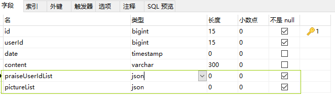

数据库里存储的值是这样的

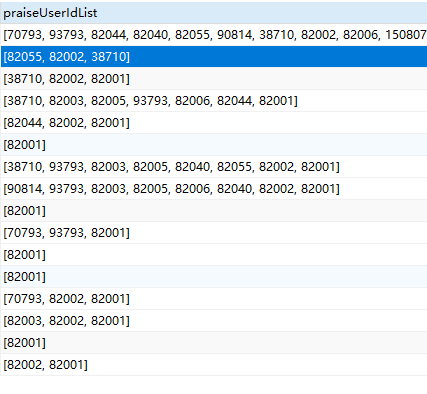

如果我们想过滤出里面有`82001`的数据，我们应该这样请求

```json
{
  "[]": {
      "Moment":{
        "praiseUserIdList<>":82001,
        "@column":"id,date,content,praiseUserIdList"
      }
  }
}
```

结果是类似这样的，为了显示方便剔除了一些数据。

```json
{
    "[]": [
        
        {
            "Moment": {
                "date": "2017-02-08 16:06:11.0",
                "id": 32,
                "praiseUserIdList": [
                    38710,
                    82002,
                    82001
                ]
            }
        },
        {
            "Moment": {
                "content": "This is a Content...-435",
                "date": "2017-02-01 19:14:31.0",
                "id": 58,
                "praiseUserIdList": [
                    38710,
                    82003,
                    82001
                ]
            }
        },
        {
            "Moment": {
                "content": "https://gss2.bdstatic.com/-fo3dSag_xIb.jpg",
                "date": "2018-10-27 17:58:02.0",
                "id": 1540634282433,
                "praiseUserIdList": [
                    82001
                ]
            }
        }
    ],
    "code": 200,
    "msg": "success"
}
```


##### 分页

对于数量太多的数据，我们很多时候都需要分页操作，这时候我们可以用类似下面这样的请求

```json
{
  "[]": {
      "Moment":{
        "@column":"id,date,content,praiseUserIdList"
      },
    "page": 0,
    "count": 5
  }
}
```

请注意，这里的`page`和`count`是放在`[]`内的属性，而不是`Moment`对象里。这里`count`表示每页的数量，`page`表示第几页，页数从0开始算。

也许你想看看这个请求对应的SQL语句

```sql
SELECT `id`,`date`,`content`,`praiseUserIdList` FROM `thea`.`Moment` LIMIT 5 OFFSET 0
```

这里`thea`是我自己的`schema`的名字，你的可能会有所不同。

如果不想分页的，也提供了一套特殊的查询方式。这种查询方式有三种，请求方式类型这样

```json
{
  "[]": {
      "Moment":{
        "@column":"id,date,content,praiseUserIdList"
      },
    "query": 2
  },
  "total@":"/[]/total"
}
```

这里因为`query`的值是2，所有会查询`Moment`表中所有的数据。如果是1的话，则会返回当前表的总数

```json
{"total":59,"code":200,"msg":"success"}
```


数据库中的数量：

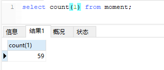


当然，如果你添加了过滤条件，返回的数量就会是你所过滤的数量，比如：

```json
{
  "[]": {
      "Moment":{
        "@column":"id,date,content,praiseUserIdList",
        "praiseUserIdList<>":38710
      },
    "query": 1
  },
  "total@":"/[]/total"
}
```

返回：

```json
{"total":12,"code":200,"msg":"success"}
```


##### 排序

要使用排序的话，这样操作

```json
{
  "[]": {
      "Moment":{
        "@column":"id,date,content,praiseUserIdList",
        "praiseUserIdList<>":38710,
        "@order":"date-,id,content+"
      }
  }
}
```

`"@order":"date-,id,content+"`其中，字段的前后顺序表示字段排序的优先级。`id`和`id+`是等价的，默认就是升序排列。`date-`表示将`date`字段降序排列。

##### 关联查询

在讲解关联查询的时候，我们需要先了解下表之间的关系

现在有两张表USER和MOMENT，两张表的关系是下面这样

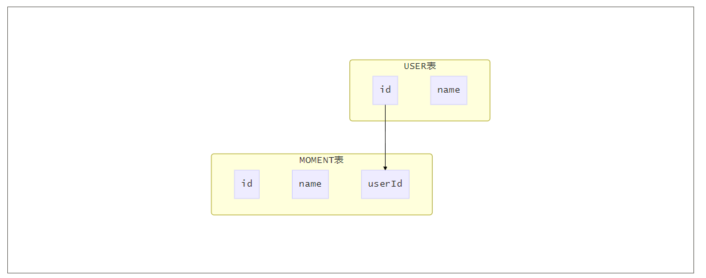

MOMENT表示评论，每一条评论会有一个发表评论的用户USER，所以MOMENT表里会有一个USER表的外键关联

对于这样的数据关系，我们在查询评论时，很多时候我们会连带着用户一起查处来，这样又如何操作呢

```json
{
  "[]": {
    "Moment":{
        "@column":"id,date,userId",
        "id":12
      },
    "User":{
      "id@":"/Moment/userId",
      "@column":"id,name"
    }
  }
}
```

这个请求稍微复杂点，首先我们用`[]`对象表示我们是想查询出一个列表，这个列表包含两个部分`Moment`和`User`。

其中`Moment`是我们想要查询的主要内容，它的写法也和一般查询数据时无异。

`User`是与`Moment`相关联的数据，所以查询的时候我们需要用`id@`来表示他们之间的关联关系

`/Moment/userId`中，最开始的`/`相当于是指明了`[]`的位置，`/Moment`表示`[]`对象下的`Moemnt`对象，`/Moment/userId`表示`Moemnt`的`userId`字段是与`User`的`id`关联的。

响应的数据：

```json
{
    "[]": [
        {
            "Moment": {
                "date": "2017-02-08 16:06:11.0",
                "id": 12,
                "userId": 70793
            },
            "User": {
                "id": 70793,
                "name": "Strong"
            }
        }
    ],
    "code": 200,
    "msg": "success"
}
```


##### 分组查询

在了解分组查询之前，我们需要先了解下APIJSON所支持的函数

| 函数名 | 说明                       |
| ------ | -------------------------- |
| count  | 统计分组下，某字段的个数   |
| sum    | 统计分组下，某字段的和     |
| max    | 统计分组下，某字段的最大值 |
| min    | 统计分组下，某字段的最小值 |
| avg    | 统计分组下，某字段的平均值 |

比如，如果只是单纯的查出最大值，这样请求就可以了

```json
{
  "[]": {
      "Moment":{
        "@column":"max(id):maxid"
      }
  }
}
```

响应：

```json
{
    "[]": [
        {
            "Moment": {
                "maxid": 1541912160047
            }
        }
    ],
    "code": 200,
    "msg": "success"
}
```

这里`maxid`是我们取的别名

如果是有分组条件的，那我们需要使用`@group`

比如，像下面SALE表，这张表表示，2018年1月1日某公司门下的3个店铺（STORE_ID）的营业额（AMT）数据

| ID   | STORE_ID | AMT  |
| ---- | -------- | ---- |
| 1    | 1        | 100  |
| 2    | 1        | 80   |
| 3    | 2        | 30   |
| 4    | 2        | 100  |
| 5    | 3        | 210  |

如果，我们想要计算出这天每个店铺一共卖了多少，我们通过APIJSON可以这样查询

```
{
  "[]": {
      "Sale":{
        "@column":"store_id,sum(amt):totAmt",
        "@group":"store_id"
      }
  }
}
```

#### C-1-4.登录

如果没有登录，由于权限的限制，是需要登录的。

登录地址`http://127.0.0.1:8080/login`，发送请求

```json
{
  "phone": "13000038710",
  "password":"apijson"
}
```

账号和密码，可以到`apijson_user`里面查询

#### C-1-5.测试新增

接口地址：`http://localhost:8080/post`

我们想新增一条备注时，发送这样的请求

请求

```json
{
 "Moment":{
      "content":"今天天气不错，到处都是提拉米苏雪",
      "userId":38710
 },
  "tag":"Moment"
}
```

`tag`是我们在`request`表里面配置的`tag`字段。

响应

```json
{
    "Moment": {
        "code": 200,
        "count": 1,
        "id": 1544520921923,
        "msg": "success"
    },
    "code": 200,
    "msg": "success"
}
```

返回的`id`是新增的数据的新id

#### C-1-4.测试修改

接口地址：`http://localhost:8080/put`

修改备注和新增类似

请求

```json
{
 "Moment":{
      "id":1544520921923,
      "content":"海洋动物数量减少，如果非吃不可，不点杀也是在保护它们"
 },
  "tag":"Moment"
}
```

响应

```json
{
    "Moment": {
        "code": 200,
        "count": 1,
        "id": 1544520921923,
        "msg": "success"
    },
    "code": 200,
    "msg": "success"
}
```

如果要对`json`类型操作的话，这样请求

```json
{
 "Moment":{
      "id":1544520921923,
      "praiseUserIdList+": [123]
 },
  "tag":"Moment"
}
```

这里的`praiseUserIdList`是一个`json`类型的字段，在操作之前它是空的`[]`，提交以后它是`[123]`，如果再添加一个21，则会变成`[123,21]`

要删除其中的值，把`+`变成`-`即可

#### C-1-5.测试删除

接口地址：`http://localhost:8080/delete`

请求

```json
{
 "Moment":{
      "id":1544520921923
 },
  "tag":"Moment"
}
```

### C-2.新增接口

#### 1. 后台添加数据表

在自己的数据库里新增一个表，比如我这里新增`b_stone`

```sql
-- 原石
CREATE TABLE `b_stone` (
  `id` bigint(20) NOT NULL AUTO_INCREMENT,
  `cost` int(10) NULL COMMENT '成本',
  `price` int(10) NULL COMMENT '卖价',
  `length` int(10) NULL,
  `width`  int(10) NULL,
  `height` int(10) NULL,
  `weight` float(8,1) NULL,
  `creationdate` datetime default CURRENT_TIMESTAMP COMMENT '创建时间',
  `modifydate` timestamp DEFAULT CURRENT_TIMESTAMP ON UPDATE CURRENT_TIMESTAMP COMMENT '修改时间',
  `modifier` varchar(80) NULL,
  PRIMARY KEY (`id`)
)ENGINE=InnoDB DEFAULT CHARSET=utf8;
```


#### 2. 在Model中添加对象并配置权限

项目的model目录下，新增一个类

```java
package apijson.demo.server.model;

import zuo.biao.apijson.MethodAccess;

@MethodAccess
public class Stone {
}
```

注解`@MethodAccess`的配置，可以参考其他类


由于我们的类名和数据库表名不一致，需要注册一下。如果一样就不需要了。

设置数据库的实际表名`DemoSQLConfig`，38行

```java
//表名映射，隐藏真实表名，对安全要求很高的表可以这么做
	static {
		TABLE_KEY_MAP.put(User.class.getSimpleName(), "apijson_user");
		TABLE_KEY_MAP.put(Privacy.class.getSimpleName(), "apijson_privacy");
		TABLE_KEY_MAP.put(Stone.class.getSimpleName(), "b_stone"); // <--这一句
	}
```


注册权限是必须的，这样程序才能使用你配置的类权限去管理你的接口

`DemoSQLConfig`，48行

```java
static { //注册权限
		ACCESS_MAP.put(User.class.getSimpleName(), getAccessMap(User.class.getAnnotation(MethodAccess.class)));
....
		ACCESS_MAP.put(Stone.class.getSimpleName(), getAccessMap(Stone.class.getAnnotation(MethodAccess.class)));
	}
```

#### 3. 接口管理Request表的配置

（此处需要作者补充）


:first_quarter_moon_with_face:此处的介绍都只是简要介绍，只是为了引导刚刚接触APIJSON的道友快速了解APIJSON，并不代表APIJSON只有这些功能，具体功能详情参考下列图表

#### 4. 完整功能图表

##### 4.1接口功能

| 方法及说明                                                   | URL              | Request                                                      | Response                                                     |
| ------------------------------------------------------------ | ---------------- | ------------------------------------------------------------ | ------------------------------------------------------------ |
| GET: <br > 普通获取数据，<br > 可用浏览器调试                | base_url/get/    | { &nbsp;&nbsp; TableName:{ &nbsp;&nbsp;&nbsp;&nbsp; … <br > &nbsp;&nbsp; }<br >} <br > {…}内为限制条件<br ><br > 例如获取一个id为235的Moment：<br >{<br > &nbsp;&nbsp; "Moment":{<br > &nbsp;&nbsp;&nbsp;&nbsp; "id":235<br > &nbsp;&nbsp; }<br >} | {<br > &nbsp;&nbsp; TableName:{<br > &nbsp;&nbsp;&nbsp;&nbsp; ...<br > &nbsp;&nbsp; },<br > &nbsp;&nbsp; "code":200,<br > &nbsp;&nbsp; "msg":"success"<br >}<br >例如<br >{<br > &nbsp;&nbsp; "Moment":{<br > &nbsp;&nbsp;&nbsp;&nbsp; "id":235,<br > &nbsp;&nbsp;&nbsp;&nbsp; "userId":38710,<br > &nbsp;&nbsp;&nbsp;&nbsp; "content":"APIJSON,let interfaces and documents go to hell !"<br > &nbsp;&nbsp; },<br > &nbsp;&nbsp; "code":200,<br > &nbsp;&nbsp; "msg":"success"<br > } |
| HEAD: <br > 普通获取数量，<br > 可用浏览器调试               | base_url/head/   | {<br > &nbsp;&nbsp; TableName:{<br > &nbsp;&nbsp;&nbsp;&nbsp; …<br > &nbsp;&nbsp; }<br > } <br > {…}内为限制条件 <br ><br > 例如获取一个id为38710的User所发布的Moment总数：<br >{<br > &nbsp;&nbsp; "Moment":{<br > &nbsp;&nbsp;&nbsp;&nbsp; "userId":38710<br > &nbsp;&nbsp; }<br >} | {<br > &nbsp;&nbsp; TableName:{<br > &nbsp;&nbsp;&nbsp;&nbsp; "code":200,<br > &nbsp;&nbsp;&nbsp;&nbsp; "msg":"success",<br > &nbsp;&nbsp;&nbsp;&nbsp; "count":10<br > &nbsp;&nbsp; },<br > &nbsp;&nbsp; "code":200,<br > &nbsp;&nbsp; "msg":"success"<br >} <br > 例如<br >{<br > &nbsp;&nbsp; "Moment":{<br > &nbsp;&nbsp;&nbsp;&nbsp; "code":200,<br > &nbsp;&nbsp;&nbsp;&nbsp; "msg":"success",<br > &nbsp;&nbsp;&nbsp;&nbsp; "count":10<br > &nbsp;&nbsp; },<br > &nbsp;&nbsp; "code":200,<br > &nbsp;&nbsp;  "msg":"success"<br >} |
| GETS: <br > 安全/私密获取数据，<br > 用于获取钱包等<br >对安全性要求高的数据 | base_url/gets/   | 最外层加一个"tag":tag，其它同GET                             | 同GET                                                        |
| HEADS: <br > 安全/私密获取数量，<br > 用于获取银行卡数量等<br >对安全性要求高的数据总数 | base_url/heads/  | 最外层加一个"tag":tag，其它同HEAD                            | 同HEAD                                                       |
| POST: <br > 新增数据                                         | base_url/post/   | {<br > &nbsp;&nbsp; TableName:{<br > &nbsp;&nbsp;&nbsp;&nbsp; …<br > &nbsp;&nbsp; },<br > &nbsp;&nbsp; "tag":tag<br >} <br > {…}中id由后端生成，不能传 <br ><br >例如一个id为38710的User发布一个新Moment：<br >{<br > &nbsp;&nbsp; "Moment":{<br > &nbsp;&nbsp;&nbsp;&nbsp; "userId":38710,<br > &nbsp;&nbsp;&nbsp;&nbsp; "content":"APIJSON,let interfaces and documents go to hell !"<br > &nbsp;&nbsp; },<br > &nbsp;&nbsp; "tag":"Moment"<br >} | {<br > &nbsp;&nbsp; TableName:{<br > &nbsp;&nbsp;&nbsp;&nbsp; "code":200,<br > &nbsp;&nbsp;&nbsp;&nbsp; "msg":"success",<br > &nbsp;&nbsp;&nbsp;&nbsp; "id":38710<br > &nbsp;&nbsp; },<br > &nbsp;&nbsp; "code":200,<br > &nbsp;&nbsp; "msg":"success"<br >}<br >例如<br >{<br > &nbsp;&nbsp; "Moment":{<br > &nbsp;&nbsp;&nbsp;&nbsp; "code":200,<br > &nbsp;&nbsp;&nbsp;&nbsp; "msg":"success",<br > &nbsp;&nbsp;&nbsp;&nbsp; "id":120<br > &nbsp;&nbsp; },<br > &nbsp;&nbsp; "code":200,<br > &nbsp;&nbsp; "msg":"success"<br >} |
| PUT: <br > 修改数据，<br > 只修改所传的字段                  | base_url/put/    | {<br > &nbsp;&nbsp; TableName:{<br > &nbsp;&nbsp;&nbsp;&nbsp; "id":id,<br > &nbsp;&nbsp;&nbsp;&nbsp; …<br > &nbsp;&nbsp; },<br > &nbsp;&nbsp; "tag":tag<br >} <br > {…}中id必传 <br ><br >例如修改id为235的Moment的content：<br >{<br > &nbsp;&nbsp; "Moment":{<br > &nbsp;&nbsp;&nbsp;&nbsp; "id":235,<br > &nbsp;&nbsp;&nbsp;&nbsp; "content":"APIJSON,let interfaces and documents go to hell !"<br > &nbsp;&nbsp; },<br > &nbsp;&nbsp; "tag":"Moment"<br >} | 同POST                                                       |
| DELETE: <br > 删除数据                                       | base_url/delete/ | {<br > &nbsp;&nbsp; TableName:{<br > &nbsp;&nbsp;&nbsp;&nbsp; "id":id<br > &nbsp;&nbsp; },<br > &nbsp;&nbsp; "tag":tag<br >} <br > {…}中id必传，一般只传id <br ><br >例如删除id为120的Moment：<br >{<br > &nbsp;&nbsp; "Moment":{<br > &nbsp;&nbsp;&nbsp;&nbsp; "id":120<br > &nbsp;&nbsp; },<br > &nbsp;&nbsp; "tag":"Moment"<br >} | 同POST                                                       |

1.TableName指要查询的数据库表Table的名称字符串。第一个字符为大写字母，剩下的字符要符合英语字母、数字、下划线中的任何一种。对应的值的类型为JSONObject，结构是 {...}，里面放的是Table的字段(列名)。下同。<br >
2."tag":tag 后面的tag是非GET、HEAD请求中匹配请求的JSON结构的key，一般是要查询的table的名称，由后端Request表中指定。下同。<br >
3.GET、HEAD请求是开放请求，可任意组合任意嵌套。其它请求为受限制的安全/私密请求，对应的 方法、tag、结构 都必须和 后端Request表中所指定的 一一对应，否则请求将不被通过。下同。<br >
4.GETS与GET、HEADS与HEAD分别为同一类型的操作方法，请求稍有不同但返回结果相同。下同。<br >
5.在HTTP通信中，GET、HEAD方法一般用HTTP GET请求，其它一般用HTTP POST请求。下同。<br >
6.所有JSONObject都视为容器(或者文件夹)，结构为 {...} ，里面可以放普通对象或子容器。下同。<br >
7.每个对象都有一个唯一的路径(或者叫地址)，假设对象名为refKey，则用 key0/key1/.../refKey 表示。下同。

:notebook:注意

1. Oracle数据库直接使用的是当前时间的LONG值，作为插入时新数据ID的

<br >

##### 4.1 功能符<h3/>

| 功能                 | 键值对格式                                                   | 使用示例                                                     |
| -------------------- | ------------------------------------------------------------ | ------------------------------------------------------------ |
| 查询数组             | "key[]":{}，后面是JSONObject，key可省略。当key和里面的Table名相同时，Table会被提取出来，即 {Table:{Content}} 会被转化为 {Content} | [{"User[]":{"User":{}}}](http://apijson.cn:8080/get/{"User[]":{"count":3,"User":{}}})，查询一个User数组。这里key和Table名都是User，User会被提取出来，即 {"User":{"id", ...}} 会被转化为 {"id", ...} |
| 匹配选项范围         | "key{}":[]，后面是JSONArray，作为key可取的值的选项           | ["id{}":[38710,82001,70793]](http://apijson.cn:8080/get/{"User[]":{"count":3,"User":{"id{}":[38710,82001,70793]}}})，查询id符合38710,82001,70793中任意一个的一个User数组 |
| 匹配条件范围         | "key{}":"条件0,条件1..."，条件为任意SQL比较表达式字符串，非Number类型必须用''包含条件的值，如'a' | ["id{}":"<=80000,\>90000"](http://apijson.cn:8080/get/{"User[]":{"count":3,"User":{"id{}":"<=80000,\>90000"}}})，查询id符合id\<=80000 \| id>90000的一个User数组 |
| 包含选项范围         | "key<\>":Object  =>  "key<\>":[Object]，key对应值的类型必须为JSONArray，Object类型不能为JSON | ["contactIdList<\>":38710](http://apijson.cn:8080/get/{"User[]":{"count":3,"User":{"contactIdList<\>":38710}}})，查询contactIdList包含38710的一个User数组 |
| 远程调用函数         | "key()":"函数表达式"，函数表达式为 function(key0,key1...)，会调用后端对应的函数 function(JSONObject request, String key0, String key1...) | ["isPraised()":"isContain(praiseUserIdList,userId)"](http://apijson.cn:8080/get/{"Moment":{"id":301,"isPraised()":"isContain(praiseUserIdList,userId)"}})，会调用 boolean isContain(JSONObject request, String array, String value) 函数，然后变为 "isPraised":true 这种（假设点赞用户id列表包含了userId，即这个User点了赞） |
| 引用赋值             | "key@":"引用路径"，引用路径为用/分隔的字符串。以/开头的是缺省引用路径，从声明key所处容器的父容器路径开始；其它是完整引用路径，从最外层开始。<br /> 被引用的refKey必须在声明key的上面。如果对refKey的容器指定了返回字段，则被引用的refKey必须写在@column对应的值内，例如 "@column":"refKey,key1,..." | ["Moment":{<br /> &nbsp;&nbsp; "userId":38710<br />},<br />"User":{<br /> &nbsp;&nbsp; "id@":"/Moment/userId"<br />}](http://apijson.cn:8080/get/{"Moment":{"userId":38710},"User":{"id@":"%252FMoment%252FuserId"}})<br /> User内的id引用了与User同级的Moment内的userId，<br />即User.id = Moment.userId，请求完成后<br > "id@":"/Moment/userId" 会变成 "id":38710 |
| 模糊搜索             | "key$":"SQL搜索表达式"  =>  "key$":["SQL搜索表达式"]，任意SQL搜索表达式字符串，如 %key%(包含key), key%(以key开始), %k%e%y%(包含字母k,e,y) 等，%表示任意字符 | ["name$":"%m%"](http://apijson.cn:8080/get/{"User[]":{"count":3,"User":{"name$":"%2525m%2525"}}})，查询name包含"m"的一个User数组 |
| 正则匹配             | "key?":"正则表达式"  =>  "key?":["正则表达式"]，任意正则表达式字符串，如 ^[0-9]+$ ，可用于高级搜索 | ["name?":"^[0-9]+$"](http://apijson.cn:8080/get/{"User[]":{"count":3,"User":{"name%253F":"^[0-9]%252B$"}}})，查询name中字符全为数字的一个User数组 |
| 新建别名             | "name:alias"，name映射为alias，用alias替代name。可用于 column,Table,SQL函数 等。只用于GET类型、HEAD类型的请求 | ["@column":"toId:parentId"](http://apijson.cn:8080/get/{"Comment":{"@column":"id,toId:parentId","id":51}})，将查询的字段toId变为parentId返回 |
| 增加 或 扩展         | "key+":Object，Object的类型由key指定，且类型为Number,String,JSONArray中的一种。如 82001,"apijson",["url0","url1"] 等。只用于PUT请求 | "praiseUserIdList+":[82001]，添加一个点赞用户id，即这个用户点了赞 |
| 减少 或 去除         | "key-":Object，与"key+"相反                                  | "balance-":100.00，余额减少100.00，即花费了100元             |
| 逻辑运算             | &, \|, ! 逻辑运算符 <br /><br />① & 可用于"key&{}":"条件"等<br /><br />② \| 可用于"key\|{}":"条件", "key\|{}":[]等，一般可省略<br /><br />③ ! 可单独使用，如"key!":Object，也可像&,\|一样配合其他功能符使用 | ① ["id&{}":">80000,<=90000"](http://apijson.cn:8080/head/{"User":{"id&{}":">80000,<=90000"}})，即id满足id>80000 & id<=90000<br /><br /> ② ["id\|{}":">90000,<=80000"](http://apijson.cn:8080/head/{"User":{"id\|{}":">90000,<=80000"}})，同"id{}":">90000,<=80000"，即id满足id>90000 \| id<=80000<br /><br /> ③ ["id!{}":[82001,38710]](http://apijson.cn:8080/head/{"User":{"id!{}":[82001,38710]}})，即id满足 ! (id=82001 \| id=38710)，可过滤黑名单的消息 |
| 数组关键词           | "key":Object，key为 "[]":{} 中{}内的关键词，Object的类型由key指定<br /><br />① "count":Integer，查询数量，假设允许查询数组的最大数量为max(默认为100)，则当count在1~max范围内时，查询count个；否则查询max个 <br /><br />② "page":Integer，查询页码，从0开始，一般和count一起用<br /><br />③ "query":Integer，查询内容<br />0-对象，1-总数，2-以上全部<br />总数关键词为total，和query同级，通过引用赋值得到，如 "total@":"/[]/total" <br />这里query及total仅为GET类型的请求提供方便，一般可直接用HEAD类型的请求获取总数<br /><br />④ "join":"&/Table0/key0@,\</Table1/key1@"<br />多表连接方式：<br /> "\<" - LEFT JOIN <br /> ">" - RIGHT JOIN <br /> "&" - INNER JOIN <br /> "\|" - FULL JOIN <br />  "!" - OUTTER JOIN <br /> | ① 查询User数组，最多5个：<br />["count":5](http://apijson.cn:8080/get/{"[]":{"count":5,"User":{}}})<br /><br /> ② 查询第3页的User数组，每页5个：<br />["count":5,<br />"page":3](http://apijson.cn:8080/get/{"[]":{"count":5,"page":3,"User":{}}})<br /><br /> ③ 查询User数组和对应的User总数：<br />["[]":{<br /> &nbsp;&nbsp; "query":2,<br /> &nbsp;&nbsp; "User":{}<br />},<br />"total@":"/[]/total"](http://apijson.cn:8080/get/{"[]":{"query":2,"count":5,"User":{}},"total@":"%252F[]%252Ftotal"})<br />总页数、是否有下一页等信息可通过 total,count,page 得出，<br />总页数 int totalPage = Math.ceil(total \/ count)<br />是否有下一页 boolean hasNextPage = total > count\*page<br />是否为第一页 boolean isFirstPage = page <= 0<br />是否为最后一页 boolean isLastPage = total <= count\*page<br />... <br /><br /> ④ Moment INNER JOIN User LEFT JOIN Comment：<br />["[]":{<br /> &nbsp;&nbsp; "join": "&/User/id@,\</Comment/momentId@",<br /> &nbsp;&nbsp; "Moment":{},<br /> &nbsp;&nbsp; "User":{<br /> &nbsp;&nbsp;&nbsp;&nbsp; "name?":"t",<br /> &nbsp;&nbsp;&nbsp;&nbsp; "id@": "/Moment/userId"<br /> &nbsp;&nbsp; },<br /> &nbsp;&nbsp; "Comment":{<br /> &nbsp;&nbsp;&nbsp;&nbsp; "momentId@": "/Moment/id"<br /> &nbsp;&nbsp; }<br />}](http://apijson.cn:8080/get/{"[]":{"count":5,"join":"&%252FUser%252Fid@,<%252FComment%252FmomentId@","Moment":{"@column":"id,userId,content"},"User":{"name%253F":"t","id@":"%252FMoment%252FuserId","@column":"id,name,head"},"Comment":{"momentId@":"%252FMoment%252Fid","@column":"id,momentId,content"}}}) |
| 对象关键词，可自定义 | "@key":Object，@key为 Table:{} 中{}内的关键词，Object的类型由@key指定<br /><br />① "@combine":"&key0,\|key1,!key2,..."，条件组合方式，\| 可省略<br /><br />② "@column":"column;function(arg)..."，返回字段<br /><br />③ "@order":"column0+,column1-..."，排序方式<br /><br />④ "@group":"column0,column1..."，分组方式。如果@column里声明了Table的id，则id也必须在@group中声明；其它情况下必须满足至少一个条件:<br />1.分组的key在@column里声明<br />2.Table主键在@group中声明 <br /><br />⑤ "@having":"function0(...)?value0;function1(...)?value1;function2(...)?value2..."，SQL函数条件，一般和@group一起用，函数一般在@column里声明<br /><br />⑥ "@otherKey": Object，自定义关键词，名称和以上系统关键词不一样，且原样返回上传的值 | ① 搜索name或tag任何一个字段包含字符a的User列表：<br />["name?":"a",<br />"tag?":"a",<br />"@combine":"name?,tag?"](http://apijson.cn:8080/get/{"User[]":{"count":10,"User":{"@column":"id,name,tag","name%253F":"a","tag%253F":"a","@combine":"name%253F,tag%253F"}}})<br /><br /> ② 只查询id,sex,name这几列并且请求结果也按照这个顺序：<br />["@column":"id,sex,name"](http://apijson.cn:8080/get/{"User":{"@column":"id,sex,name","id":38710}})<br /><br /> ③ 查询按 name降序、id默认顺序 排序的User数组：<br />["@order":"name-,id"](http://apijson.cn:8080/get/{"[]":{"count":10,"User":{"@column":"name,id","@order":"name-,id"}}})<br /><br /> ④ 查询按userId分组的Moment数组：<br />["@group":"userId,id"](http://apijson.cn:8080/get/{"[]":{"count":10,"Moment":%7B"@column":"userId,id","@group":"userId,id"}}})<br /><br /> ⑤ 查询 按userId分组、id最大值>=100 的Moment数组：<br />["@column":"userId;max(id)",<br />"@group":"userId",<br />"@having":"max(id)>=100"](http://apijson.cn:8080/get/{"[]":{"count":10,"Moment":{"@column":"userId%253Bmax(id)","@group":"userId","@having":"max(id)>=100"}}})<br />还可以指定函数返回名：<br />["@column":"userId;max(id):maxId",<br />"@group":"userId",<br />"@having":"maxId>=100"](http://apijson.cn:8080/get/{"[]":{"count":10,"Moment":{"@column":"userId%253Bmax(id):maxId","@group":"userId","@having":"maxId>=100"}}})<br /><br /> ⑥ 从pictureList获取第0张图片：<br />["@position":0, //这里@position为自定义关键词<br />"firstPicture()":"getFromArray(pictureList,@position)"](http://apijson.cn:8080/get/{"User":{"id":38710,"@position":0,"firstPicture()":"getFromArray(pictureList,@position)"}}) |

<br />


